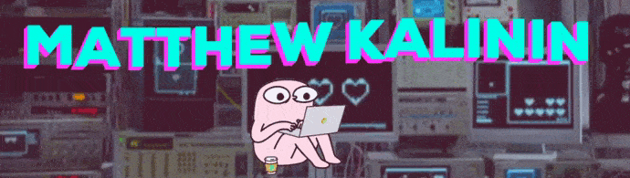

<a href="https://github.com/GrafHollywood">
<<<<<<< Updated upstream
  </img>
=======
  </img>
>>>>>>> Stashed changes
</a>

## Привет:wave:
Делаю всякие веб штуки для души:ghost: или по учебе:mortar_board:. Заинтересован в поиске интересных проектов:eyes:.

## На чем работаю:wrench:

## С чем работаю:hammer:

## Просто раздел:walking:
- 🌱 Сейчас изучаю React 
- 📫 Можешь написать мне на почту matvey.kalinin2001@mail.ru или связаться в [VK](https://vk.com/matthewkalinin)

## Социальные сети и другое:speech_balloon:

 

## Статистика:blue_book:

